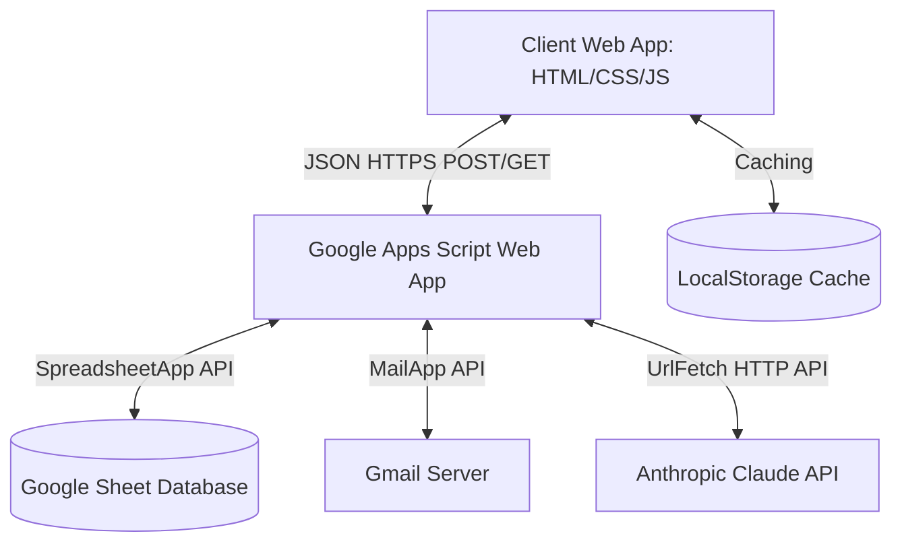
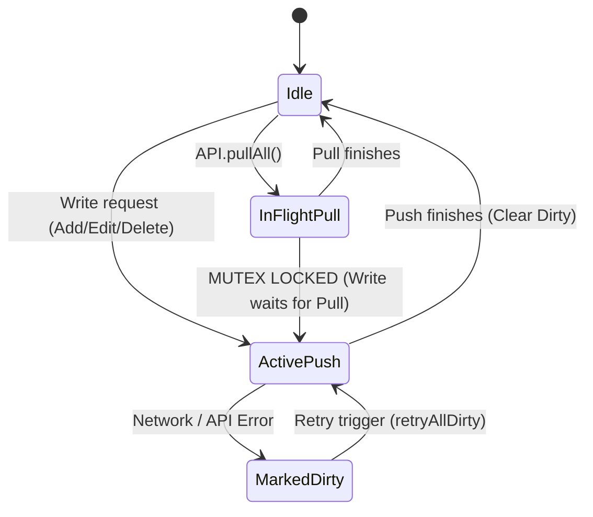
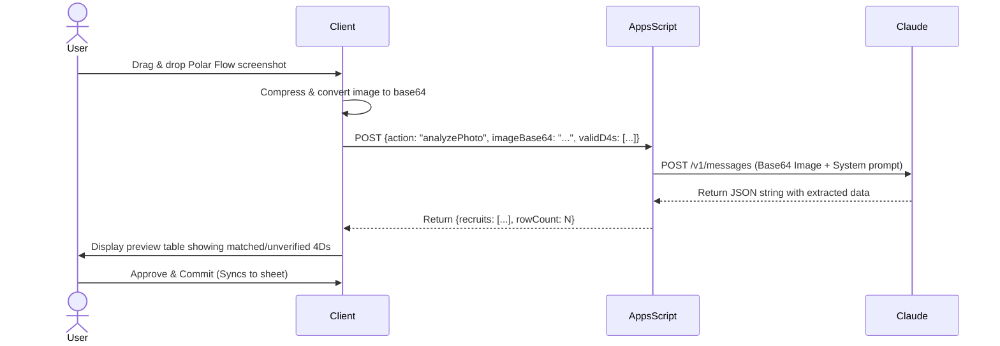

# Cougar/Braves Company Data System - Software Specification & Feature Document

This document defines the complete feature set, architecture, database schemas, and business logic of the **Cougar Company Data System** (also known as `braves-system`). This specification is designed as a direct reference prompt for replicating this system in another context.

---

## 1. System Architecture & Tech Stack

The system is designed as a **serverless, offline-first, client-heavy web application** that uses a Google Sheet as its relational data store.



### Technology Stack
*   **Frontend**: 
    *   **Core**: Single Page Application (SPA) built with Vanilla HTML5, Vanilla CSS3 (custom CSS variables, mobile-first design), and Vanilla JavaScript (ES6+). No JS frameworks (Vue, React, Angular) to ensure compatibility under local `file://` protocols, offline usage, and simple hosting (e.g., GitHub Pages).
    *   **Charts**: [Chart.js (v4)](https://www.chartjs.org/) for rendering responsive charts (doughnuts, bars, line charts).
    *   **Parsing**: [PapaParse](https://www.papaparse.com/) for client-side CSV parsing.
*   **Backend**: 
    *   **Google Apps Script (GAS)**: Serves as a serverless API endpoint deployed as a Web App (`doGet`/`doPost`).
    *   **Gmail Integration**: Handles email distribution directly from the active user's credentials.
    *   **Claude API Proxy**: Apps Script proxies image OCR requests to Anthropic's API using `UrlFetchApp`.
*   **Database**: 
    *   **Google Sheets**: Serving as the relational database, where each sheet/tab represents a database table.

---

## 2. Authentication, Invites, and Onboarding

Access is controlled via a token-based authentication model stored in Google Apps Script `PropertiesService` and client-side `localStorage`.

### Invite & Auth Handshake

```mermaid
sequenceDiagram
    actor Admin
    actor User
    participant Frontend
    participant AppsScript
    participant Properties
    
    Admin->>AppsScript: Run generateInvite() or generateBulkInvite()
    AppsScript->>Properties: Store "invite:<token>" with metadata
    AppsScript-->>Admin: Return invite URL (https://domain/?token=<token>)
    Admin->>User: Share invite URL
    User->>Frontend: Load URL in browser
    Frontend->>AppsScript: POST {action: "redeemInvite", token: "..."}
    AppsScript->>Properties: Verify invite validity & update usage
    AppsScript->>Properties: Store "auth:<authToken>"
    AppsScript-->>Frontend: Return {ok: true, authToken: "..."}
    Frontend->>User: Set authToken in localStorage & grant access
```

1.  **Single-Use Invites**: Created using `generateInvite()`. The link is active until opened. Upon the first redeem request, Apps Script generates a unique UUID (the `authToken`), sets the invite status to `{used: true}`, and creates a mapping `auth:<authToken>`.
2.  **Multi-Use Bulk Invites**: Created using `generateBulkInvite(maxUses, expiresInDays)`. The link carries a cap on redemptions (`maxUses`) and an optional expiry timestamp (`expiresAt`). Each redemption increments a counter and generates a distinct, device-specific `authToken` stored in the `auth:<authToken>` script property.
3.  **Auth Validation**: Every request from the client includes the `authToken` in the request header/body. Apps Script validates this against `auth:<authToken>` in `PropertiesService`.
4.  **Token Revocation**: Admins can revoke individual auth tokens (`revokeAuthToken`), revoke invitations (`revokeInvite`), or execute a nuclear reset (`revokeAllAuthTokens`), forcing all devices to re-onboard.

---

## 3. Database Schema (Google Sheets Tabs)

The Google Sheet is organized into **12 distinct tables (tabs)**. Row headers reside in Row 1. All data is written starting in Row 2.

### Tab 1: `Roster`
*   **Description**: The master roster containing recruit and commander personal records.
*   **Fields**:
    *   `id` / `4d` / `4D` (Primary Key): Canonical 4-digit unique identifier (padded with leading zeros if numeric, e.g., `0015` or `1101`).
    *   `name`: Text (Full name).
    *   `age`: Numeric.
    *   `status`: Text (e.g. `Active`, `Discharged`).
    *   `notes`: Text (general remarks).
    *   `phone`: Text.
    *   `email`: Text.
    *   `ration`: Text (Dietary requirements, e.g., `Halal`, `Non-Veg`, `Vegetarian`).
    *   `allergies`: Text.
    *   `msk`: Text (Musculoskeletal status indicators).
    *   `highest education level`: Text.
    *   `motorcycle license`: Text (`Yes`/`No`).
    *   `height`: Numeric (in cm).
    *   `weight`: Numeric (in kg).
    *   `role`: Text (`Recruit` or `Commander`. If blank, defaults to `Recruit` on pull. Commander IDs typically follow a `00xx` pattern).
    *   `rank`: Text (Commander ranks, e.g. `3SG`, `2LT`, `CPT`, `MSG`).
    *   `leaveQuota`: Numeric (Cap on off-in-lieu leaves, optional for recruits).

### Tab 2: `Medical`
*   **Description**: Medical log tracking sick reports, excuses, and wardings.
*   **Fields**:
    *   `id` (Primary Key): Unique numeric ID.
    *   `d4`: Unique identifier matching `Roster.id`.
    *   `date`: Date logged ("DD MMM YYYY").
    *   `reason`: Text (symptoms or diagnosis).
    *   `status`: Text (Medical tag/excuse, e.g., `MC`, `Warded`, `LD`, `RMJ`, `Excuse Heavy Load`, `Excuse Kneeling`, `Excuse Squatting`, `Excuse Uniform`, `Excuse Swimming`, `Excuse Prolonged Standing`, `Excuse Upper Limb`, `Excuse Lower Limb`, `Pending`, `NIL`).
    *   `startDate`: Date ("DD MMM YYYY").
    *   `endDate`: Date ("DD MMM YYYY").

### Tab 3: `Attendance`
*   **Description**: Summary of attendance records for specific training events (conducts).
*   **Fields**:
    *   `id` (Primary Key): Unique ID.
    *   `date`: Date ("DD MMM YYYY").
    *   `time`: Text (e.g. `0730`, `1430`).
    *   `conductId`: Text (References a `Conducts.id`).
    *   `total`: Numeric (Expected strength).
    *   `participating`: Numeric (Actual participants).
    *   `lms`: Numeric (Number of participants attending LMS).
    *   `px`: Numeric (Count of recruits on pre-existing medical statuses excused from participating).
    *   `fallout`: Numeric (Number of recruits who started but dropped out during the conduct).
    *   `remarks`: Text.

### Tab 4: `ConductDetail`
*   **Description**: Granular per-recruit reasons for missing or dropping out of specific conducts.
*   **Fields**:
    *   `id` (Primary Key): Unique ID.
    *   `date`: Date ("DD MMM YYYY").
    *   `time`: Text (e.g. `0730`).
    *   `conductId` / `conduct`: References a `Conducts.id`.
    *   `d4`: References `Roster.id`.
    *   `type`: Text (`PX` for Pre-Existing status, `RSI` for Reported Sick in morning, `Fallout` for dropped out during training, `ReportSick` for reported sick mid-day).
    *   `reason`: Text.

### Tab 5: `IPPT`
*   **Description**: Individual Physical Proficiency Test results.
*   **Fields**:
    *   `id` (Primary Key): Unique ID.
    *   `d4`: References `Roster.id`.
    *   `attempt`: Numeric (Attempt number, e.g. `1`, `2`).
    *   `date`: Date ("DD MMM YYYY").
    *   `pushups`: Numeric (Reps).
    *   `situps`: Numeric (Reps).
    *   `runTime`: Text (Formatted runtime "MM:SS").
    *   `score`: Numeric (Total points).

### Tab 6: `RouteMarch`
*   **Description**: Progress tracking for route march training events.
*   **Fields**:
    *   `id` (Primary Key): Unique ID.
    *   `d4`: References `Roster.id`.
    *   `rmNum`: Numeric (March number, e.g. `1`, `2`).
    *   `date`: Date ("DD MMM YYYY").
    *   `time`: Text (Completion time "MM:SS" or "HH:MM:SS").
    *   `avgHr`: Numeric (Average heart rate).
    *   `maxHr`: Numeric (Peak heart rate).
    *   `pass`: Text (`Y`/`N`).

### Tab 7: `SOC`
*   **Description**: Standard Obstacle Course results.
*   **Fields**:
    *   `id` (Primary Key): Unique ID.
    *   `d4`: References `Roster.id`.
    *   `socNum`: Numeric (SOC run count).
    *   `date`: Date ("DD MMM YYYY").
    *   `time`: Text (Completion time "MM:SS").
    *   `avgHr`: Numeric.
    *   `pass`: Text (`Y`/`N`).

### Tab 8: `PolarFlow`
*   **Description**: Biometric heart rate records imported from Polar Flow logs.
*   **Fields**:
    *   `id` (Primary Key): Unique ID.
    *   `d4`: References `Roster.id`.
    *   `conductId` / `conduct`: References `Conducts.id`.
    *   `date`: Date ("DD MMM YYYY").
    *   `avgHr`: Numeric (Average heart rate).
    *   `maxHr`: Numeric (Peak heart rate).
    *   `minHr`: Numeric (Minimum heart rate).
    *   `z1` - `z5`: Numeric (Minutes spent in zones 1 through 5).
    *   `calories`: Numeric (Calories burned, kcal).
    *   `trainingLoad`: Numeric.
    *   `recovery`: Numeric (Recovery hours).
    *   `duration`: Numeric (Duration in minutes).
    *   `distance`: Numeric (Distance covered in km).

### Tab 9: `Appointments`
*   **Description**: Future booked external events (e.g., medical specialist clinics).
*   **Fields**:
    *   `id` (Primary Key): Unique ID.
    *   `d4`: References `Roster.id`.
    *   `reason`: Text.
    *   `date`: Date ("DD MMM YYYY").
    *   `time`: Text (e.g. `0930`).
    *   `location`: Text.

### Tab 10: `Leave`
*   **Description**: Personnel leave and out-of-camp pass tracker.
*   **Fields**:
    *   `id` (Primary Key): Unique ID.
    *   `d4`: References `Roster.id`.
    *   `type`: Text (`Leave`, `Compassionate`, `Off-in-Lieu`, `Weekend`, `Night's Out`, `Course`, `Guard Duty`, `NDP`, `Other`).
    *   `startDate`: Date ("DD MMM YYYY").
    *   `endDate`: Date ("DD MMM YYYY").
    *   `days`: Numeric (Duration in days, accommodates half-days like `0.5`).
    *   `reason`: Text.

### Tab 11: `MSK`
*   **Description**: Musculoskeletal injury reports log, matching external self-report forms.
*   **Fields**:
    *   `timestamp`: Text (form submission date).
    *   `type`: Text (`Report Injury` or `Log Exercises`).
    *   `d4`: References `Roster.id`.
    *   `description`: Text.
    *   `physioDate`: Date ("DD MMM YYYY").
    *   `exercises`: Text.
    *   `cleared`: Boolean (`TRUE`/`FALSE`).
    *   `manualRegions`: Text (Manual overrides for analytics).

### Tab 12: `Conducts`
*   **Description**: Registry of canonical conducts.
*   **Fields**:
    *   `id` (Primary Key): Unique identifier (e.g., `c001`, `c002`).
    *   `name`: Text (e.g. `Orientation Run`, `Route March 4km`).

---

## 4. Sync Protocol & Offline Operations

The system maintains a LocalStorage-first data cache. To manage synchronization reliably without a database server, it uses a custom mutex transaction queue.



### Mutex Synchronization & Queueing Rules
1.  **Block-on-Pull Lock**: When `pullAll()` runs, a global boolean flag `_pullInFlight` locks the write pipeline. All user modifications are written to `localStorage` but their API push triggers wait until `_pullPromise` resolves, avoiding write-back of stale or un-merged state.
2.  **Write Coalescing**: If multiple edits occur rapidly on the same sheet tab while a push is already processing (`_inFlight.has(tabName)`), the app sets `_coalesced.set(tabName, true)`. Once the current push completes, it queues exactly one additional update carrying the latest client state (bulk replace mode), reducing unnecessary API roundtrips.
3.  **Dirty-Tab Recovery**: If a write fails (due to network disconnection, browser tab closure, etc.), the tab's name is added to a `dirty` set persisted in `localStorage`.
    *   On startup, the system checks for any dirty tabs and prompts the user to retry (`maybeRestoreDirty`).
    *   A warning remains visible in the sidebar footer showing the count of unsynced tabs.
4.  **Staleness Checks (Merge Conflict Prevention)**: Before a bulk push replaces an entire spreadsheet tab, the client requests a row count (`API.rowCount(tabName)`). If the sheet contains more rows than the client has locally (indicating another device committed data in the interim), the client prompts the user: `"Sheet has N more rows. Pull first?"` to prevent accidental overwrites.
5.  **Write Operations**:
    *   `appendRow`: Appends a single row object matching sheet headers.
    *   `appendMany`: Appends multiple row objects.
    *   `upsertRow`: ID-based upsert. Looks for the row matching `rowData.id`. If found, overwrites in place; otherwise appends. This allows multiple devices to edit different records without conflict.
    *   `deleteRowById`: Locates row by `id` field value and removes it.

---

## 5. Core Business Logic & Feature Specifications

### 1. Parade State & Global Filter Scope
*   **Multi-Dimension Filters**: Located in the global topbar. Allows filtering by Platoon (P1-P4), Section (S1-S4), and Role (`All`, `Recruits`, `Commanders`).
*   **Scope Inheritance**: Selecting a Platoon dynamically populates the Section selector. The role selection allows reviewing parade strengths without commanders polluting recruit stats.
*   **Strength Calculator**: The sidebar footer continually displays expected/active strengths: `Str: <Filtered Roster Length> | Active: <Filtered Roster − Absentees>`.

### 2. Medical Excuse "Ghost Tag" Calculator
The system implements a critical business rule regarding sick leaves (`MC`) and light duties (`LD`). Once an excuse expires, the recruit is subject to a 2-day recovery period before returning to heavy training.
*   **Ghost Tags**:
    *   `Day of End Date + 1`: Evaluates as `MC+1` or `LD+1`.
    *   `Day of End Date + 2`: Evaluates as `MC+2` or `LD+2`.
*   **Severity Rank Hierarchy**: When a recruit has multiple active excuses or overlapping ghost tags, the UI displays the single most-restrictive tag based on this ranking (from highest severity to lowest):
    1. `Warded`
    2. `MC`
    3. `MC+1`
    4. `MC+2`
    5. `LD`
    6. `LD+1`
    7. `LD+2`
    8. Any custom/excuse tags (e.g. `Excuse RMJ`, `Excuse Lower Limb`)
    9. `Pending`
    10. `NIL` (Cleared)

### 3. IPPT Scoring & Award Calculator
Provides instant physical scoring lookup on the client side without database dependencies.
*   **Scoring Formulas**: Evaluates age (divided into 3-year brackets), gender, push-ups reps, sit-ups reps, and 2.4km run time to determine point scores.
*   **Award Categories**:
    *   **Gold★ (Gold Honor)**: Score $\ge 90$ points
    *   **Gold**: Score $85 - 89$ points
    *   **Silver**: Score $75 - 84$ points
    *   **Pass**: Score $61 - 74$ points
    *   **Fail**: Score $\le 60$ points
    *   **YTT (Yet to Take)**: Recruits with all-zero or missing scores.
*   **Aggregation Modes**: Supports toggling metrics between "Latest attempt" and "Best attempt" per recruit.

### 4. MSK (Musculoskeletal Injury) Analytics
Tracks physical injuries and automatically classifies them to generate health heatmaps.
*   **Injury Classifier**: Reads description strings and maps keywords to body regions:
    *   `tfcc`, `wrist`, `hand`, `finger` $\rightarrow$ **Hand / Wrist**
    *   `foot`, `heel`, `toe`, `ankle`, `plantar` $\rightarrow$ **Foot**
    *   `knee`, `patella`, `acl`, `meniscus` $\rightarrow$ **Knee**
    *   `shin`, `calf`, `achilles`, `tibial` $\rightarrow$ **Shin / Calf**
    *   `thigh`, `hamstring`, `quad`, `hip` $\rightarrow$ **Upper Leg / Hip**
    *   `back`, `spine`, `lumbar`, `shoulder`, `neck` $\rightarrow$ **Back / Shoulder / Neck**
    *   Other fallbacks $\rightarrow$ **Other**
*   **Cleared status**: A toggle flag to mark an injury resolved so it can be filtered out of active injury logs.

### 5. Heat Acclimatisation (HA) Tracker
Calculates status for military heat safety compliance.
*   **A recruit achieves "Acclimatised" status when**: They complete **10 training periods** across **10 days**.
*   **A recruit's status becomes "Lapsed" if**: They fail rolling maintenance (defined as completing fewer than **2 sessions in the last 14 days**).
*   **States**: `Not Started` $\rightarrow$ `In Progress` $\rightarrow$ `Acclimatised` $\rightarrow$ `Lapsed`.

### 6. Polar Flow Screenshot OCR (Anthropic Claude Proxy)
To avoid manual data entry of fitness session summaries, users can drag and drop screenshots of the Polar Flow summary screen directly into the app.



1.  **Client-Side Compression**: The client compresses the dropped image to $<500\text{KB}$ JPEGs using a temporary HTML Canvas before transmission to avoid hitting web request size caps.
2.  **GAS Payload Proxy**: Apps Script sends the image and a strict system instruction prompt to `claude-sonnet-4-5`.
3.  **Claude Verification Procedure**:
    *   First counts the total visible rows of the table in the image (Count = $N$).
    *   Parses each row's data: `4D`, `Average HR`, `Max HR`, `Calories`, and `Duration`.
    *   Compares the parsed array length to $N$ to detect truncation errors.
    *   Uses a list of valid company IDs passed by the client to resolve digit ambiguities (e.g. mapping blurry `1108` to `1109` if `1108` doesn't exist).
    *   If a 4D is parsed but not found in the roster list, it tags it as `unverified` instead of discarding it.
4.  **Operator Review**: The client displays a preview table. The user checks unverified items, makes adjustments, and clicks "Commit" to push directly to the sheet.

### 7. Bulk Email Fitness Reports
Enables emailing personalized HTML summary digests to recruits.
*   **Data Assembly**: For each recruit in the active filter scope, the client gathers:
    1.  Their IPPT attempts trend chart.
    2.  Polar Flow biometric training logs (average/max heart rate curve).
    3.  Route March completion records.
    4.  An encouraging text block generated dynamically from their training performance metrics.
*   **Base64 Canvas Attachment**: Canvas charts generated locally on the client DOM are read as base64 images.
*   **Inline `cid:` Reference**: The client wraps the email body and base64 charts into a payload. Apps Script converts the base64 charts into `Blob` attachments and maps them using inline image tags (``) so the charts render inline within email clients (bypassing blocking of standard inline base64 images by providers like Gmail).

---

## 6. UI/UX & Responsive Layout Specifications

The UI adopts a highly polished, desktop-centric layout that smoothly reflows onto mobile screens.

*   **Color Palette**: Dark mode styling.
    *   Background: `#0D1117`
    *   Surface cards: `#161B22`
    *   Secondary surface: `#21262D`
    *   Border: `#30363D`
    *   Main Text: `#E6EDF3`
    *   Accents: HSL-tailored colors (Green: `#3FB950`, Orange: `#D29922`, Red: `#F85149`, Accent Blue: `#58A6FF`).
*   **Desktop Layout**:
    *   Left-docked sidebar (`width: 190px`) containing navigation links.
    *   Sticky topbar containing search bar and global scope dropdown filters.
    *   Main viewport container (`#content`) with a 20px padding and horizontal scrolling disabled (`overflow-x: hidden`).
    *   Grid component columns structured using `.grid-2` with `min-width: 0` to prevent inner elements (like responsive charts) from stretching the columns.
*   **Mobile Layout (Breakpoints $\le 768\text{px}$)**:
    *   Sidebar slides out of view (hidden to `left: -260px`). Revealed by tapping a hamburger button (`☰`) on the topbar. A backdrop overlay handles tapping outside to dismiss.
    *   Scope selector dropdowns stack vertically inside a popover panel triggered by a "Scope" status button on the topbar.
    *   All tables are wrapped in a `.table-wrap` element with `overflow-x: auto` to allow horizontal scrolling of rows without breaking page width.
    *   Grids collapse to a single column (`grid-template-columns: 1fr !important`).
    *   Button sizes scale to a minimum height of $36\text{px}$ for tap-target compliance.
