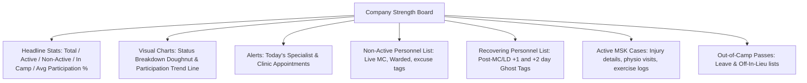
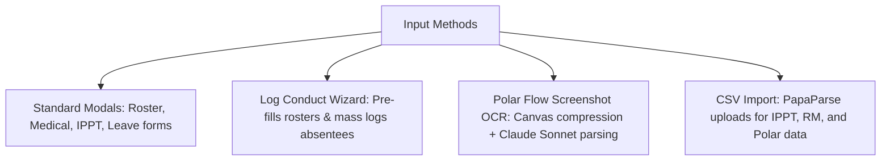

# Cougar Company Data System - User Interface & User-Facing Features

This document describes the user interface design, dashboards, interactive views, input methods, and automated reporting features of the **Cougar Company Data System** (`braves-system`). It provides a comprehensive guide to how users interact with the system, enter data, and generate reports.

---

## 1. Interface Layout & Navigation

The system is built as a single-page application (SPA) with a responsive, dark-mode design optimized for desktop operation while remaining fully functional on mobile devices.

### Desktop Layout
*   **Left-Docked Sidebar (Width: 190px)**: The navigation hub of the application. It contains buttons to switch between the 14 available pages/views.
    *   **Sidebar Footer**: Houses the real-time sheet synchronization status indicator (e.g., `● Synced 14:32:01`, `● Syncing…`, `⚠ 2 tabs need retry`), and the active strength counter.
*   **Sticky Topbar**:
    *   **Search Box**: Instantly search personnel by name or 4-digit ID (`4D`). Search results respect the active platoon/section filters.
    *   **Global Scope Filters**: Dropdown selectors for **Platoon** (P1–P4) and **Section** (S1–S4) filters, and a segmented control button group for **Role** (`All`, `Cmdrs`, `Recs`). Selecting a platoon automatically updates the sections dropdown. These filters apply globally across all tabs and charts.
    *   **Scope Indicator**: On mobile devices, a "Scope" status button displays the active filters and opens a popover filter menu.
*   **Main Viewport (`#content`)**: Fills the remaining space, styled with a padding of `20px` and horizontal scroll prevention (`overflow-x: hidden`).

### Mobile Responsive Adaptations
*   **Hamburger Toggle**: For viewports $\le 768\text{px}$, the left sidebar slides out of view (`left: -260px`). A hamburger button (`☰`) in the topbar triggers the menu to slide in, accompanied by a dark backdrop overlay. Tapping the backdrop or navigating to a new tab closes the sidebar.
*   **Responsive Grids**: Visual layouts automatically stack from multi-column grids to a single column (`grid-template-columns: 1fr`).
*   **Scrollable Tables**: Large tables are wrapped inside a `.table-wrap` element with `overflow-x: auto`, permitting horizontal scrolling without distorting the layout.
*   **Touch Targets**: Buttons and interactive controls expand to a minimum height of $36\text{px}$ to comply with standard mobile tap-target sizes.

---

## 2. Global Dashboards

### Company Strength Board (Dashboard)
The primary view upon landing. It provides commanders with a real-time summary of personnel availability and active alerts.

1.  **Headline Stats Tiles**:
    *   **Total Strength**: Total personnel matching the active filter.
    *   **Active Today**: Personnel cleared for full training (no active MC, Warded, or leave statuses).
    *   **Non-Active**: Count of personnel currently on restrictive medical statuses.
    *   **In Camp**: Personnel physically present in camp (Total minus those away on medical leave or out-of-camp pass).
    *   **Average Participation %**: Historical training attendance participation rate.
2.  **Status Breakdown (Doughnut Chart)**:
    *   Displays the distribution of active statuses (`Active`, `MC`, `Warded`, `LD`, `RMJ`, `Excuse Heavy Load`, etc.).
    *   Supports stacked statuses (a recruit on both `MC` and `Excuse Upper Limb` contributes to both categories).
    *   Color-coded segments indicate severity (Green: Active, Red: MC/Warded, Orange: LD, Blue: excuses/RMJ).
3.  **Participation Trend (Line Chart)**:
    *   A smooth line representing attendance rates chronologically.
    *   Individual segments change color according to training health: green ($\ge 95\%$), amber ($70\% - 94\%$), and red ($< 70\%$).
4.  **Today's Appointments Widget**:
    *   Displays clinic and specialist appointments scheduled for the day that occur after the parade time.
5.  **Non-Active Personnel List**:
    *   Lists recruits with active restrictive statuses. If a recruit has multiple active excuses, they are stacked vertically in a single row.
6.  **Recovering Personnel (Ghost Tags)**:
    *   Shows recruits in their 2-day recovery period following the expiration of their medical leaves (labeled as `MC+1`, `MC+2`, `LD+1`, or `LD+2`).
7.  **Active MSK Cases Widget**:
    *   Aggregates self-reported injury records. It displays the latest injury description, upcoming physio appointments, body region tags, and exercises logged by the recruit.
    *   Features quick-action buttons to **Book** an appointment or **Mark Cleared** (which moves the card to a collapsible history container).
8.  **Leave and Passes Widget**:
    *   Lists personnel on out-of-camp passes or leaves (e.g. Off-in-Lieu, Compassionate Leave) for the current day and upcoming week.

---

## 3. Dedicated Information Views

### Master Roster
*   A tabular view of the entire company directory matching the active scope.
*   Displays the 4D, full name, role (Recruit vs. Commander), rank, active status, BMI (calculated on-the-fly and color-coded), and the count of historical sick reports.
*   Includes buttons to **Export CSV** or **Re-push all** records to overwrite the Google Sheet in case of unsynced overrides.

### Conduct Attendance
*   Displays the history of training conducts (e.g., orientation runs, route marches).
*   Tracks the date, start time, conduct name, total expected strength, participating count, LMS (Learner Management System) participant count, excused personnel (`PX`), fallout count, and general remarks.
*   Calculates participation rates and LMS rates with color indicators.
*   Provides quick-actions to copy the WhatsApp chat format, edit the conduct using the wizard, or delete the record.

### Conduct Detail
*   Displays granular records of recruits missing conducts, classified by:
    *   `PX` (Pre-existing excuse/status).
    *   `RSI` (Reported sick in the morning).
    *   `Fallout` (Started but dropped out of training).
    *   `ReportSick` (Reported sick to the medical officer mid-day).
*   **Interactive Participant Summary**: When a single conduct is selected, the view generates a list of all participants by excluding the logged absentees from the roster.
*   **Most Conducts Missed Leaderboard**: Ranks recruits with the highest number of absences.

### Report Sick Log (Medical)
*   A log of all sick reports, excuses, and clinic bookings.
*   Shows the reporting date, 4D, name, reason (symptoms/diagnosis), status tag (e.g., `MC`, `LD`, `Excuse Upper Limb`), start/end dates, and today's active status.
*   **Stats Tiles**: Counts total report-sick events (unique recruit-date pairs), active statuses today, recovering (ghost tags), and pending reports.
*   **Most Reports Sick Leaderboard**: Identifies recruits who report sick most frequently.

### IPPT Tracker
*   Tracks Singapore Armed Forces Individual Physical Proficiency Test results.
*   Displays push-ups (reps), sit-ups (reps), 2.4km run time (`MM:SS`), total score, and award.
*   **Score Aggregation Toggle**: Switch between displaying each recruit's **Latest** or **Best** attempt.
*   **Visual Charts**: An award breakdown doughnut chart (`Gold★`, `Gold`, `Silver`, `Pass`, `Fail`, `YTT`) and a bar chart showing the score distribution.
*   **YTT Chase List**: Identifies recruits who have not yet taken the IPPT or have all-zero scores.
*   **Top Performers List**: Highlights the highest-scoring recruits.

### Route March Tracker
*   Tracks route march achievements.
*   **Progression Banner**: A company completion grid showing the completion count for each march tier (RM 1 to RM 6, from 3KM up to 12KM).
*   Logs completion times, average and peak heart rates, and a pass/fail indicator.

### SOC Tracker
*   Logs Standard Obstacle Course (SOC) run attempts.
*   Displays attempt number, date, time, average heart rate, and pass/fail status.

### Heat Acclimatisation (HA) Tracker
*   Tracks safety compliance status for training in hot weather.
*   **Status Roster**: Classifies recruits into one of four states:
    *   `Acclimatised`: Completed 10 training periods across 10 days.
    *   `In Progress`: Actively building the acclimatisation streak.
    *   `Lapsed`: Failed to complete at least 2 sessions in the last 14 days.
    *   `Not Started`: No training sessions logged yet.
*   **Visual Charts**: A doughnut chart of the status breakdown and a horizontal bar chart plotting each recruit's active streak days.

### Polar Flow Data
*   Displays biometric data imported from Polar wearable fitness watches (Average HR, Max HR, Min HR, Calories, Training Load, Recovery hours, Duration, Distance).
*   **Polar Attendance Gaps Tracker**: Cross-references attendance logs with Polar data to list recruits who attended a training session but do not have a heart rate log recorded. This allows commanders to follow up with recruits who forgot to wear or synchronize their watches.

### Leave / Out Tracker
*   Displays passes, night-out records, courses, and leaves.
*   **Timeline View**: A horizontal Gantt-style timeline plotting leave spans across the week, helping commanders plan duty rosters.

### MSK Analytics
*   Provides an analytical breakdown of musculoskeletal injuries.
*   **Daily MSK Impact (Stacked Bar Chart)**: Tracks the count of unique recruits affected per day, stacked by category (`Status` vs. `Fallout` vs. `RSI`).
*   **Affected Trend (Line Chart)**: Plots the total number of unique injury cases per day.
*   **Injury by Region Charts**: Doughnut and horizontal bar charts showing injury distributions (e.g., Hand/Wrist, Knee, Shin/Calf, Foot) automatically classified from description keywords. Clicking a slice drills down to show the recruits and their source text.
*   **Chronic / Recurring Cases**: Alerts commanders to recruits with both a reported injury and $\ge 3$ missed conducts due to MSK issues.

### Conducts Registry
*   A management console listing all canonical conducts.
*   Displays total usage counts across the database.
*   **Merge & Rename Tools**: Renaming a conduct updates all views without editing the original records. Merging combines near-duplicate conducts.

### Sync & Import/Export
*   An operations panel to manage offline caches and sync queues.
*   Features connection ping tests, manual full pull/push actions, and a synchronization log.
*   **Import/Export Widgets**: Supports backing up and restoring the database via a single JSON file, or exporting individual tables to CSV.

---

## 4. Input Methods & Wizards

The system features robust forms and automated input pipelines to reduce manual entry errors.

### Standard Input Modals
Forms are rendered inside a centered modal overlay. Dropdowns for selecting personnel auto-suggest names based on 4Ds.
*   **IPPT Score Calculator**: As the user types push-up/sit-up reps and 2.4km run times, the form dynamically calculates and displays the points and award tier on the fly based on the recruit's age group.

### One-Shot Log Conduct Wizard
Designed to simplify logging training events. Instead of editing multiple tables, the user logs a conduct in a single checklist view:
1.  **Configure Conduct**: Enter date, time, and select the conduct type.
2.  **Roster Checklist**: Displays the roster. By default, all recruits are checked as participating.
3.  **Absence Log**: Unchecking a recruit reveals a type selector (`PX` for status, `RSI`, `Fallout`, or `ReportSick`) and a text box to document the reason.
4.  **Auto-calculation**: Upon submission, the wizard creates an attendance row (calculating participating, fallout, and LMS counts), appends conduct detail rows for each absentee, and prompts the user to copy the pre-formatted WhatsApp parade state.

### Polar Flow Screenshot OCR (Anthropic Claude Proxy)
Commanders can upload or drag-and-drop screenshots of Polar Flow class summaries directly into the browser:
1.  **Client-Side Compression**: An HTML5 Canvas compresses the image to $<500\text{KB}$ to ensure fast uploads.
2.  **Claude OCR Parsing**: The image is sent to Claude Sonnet. Claude identifies the column headers, counts the table rows to verify completeness, extracts biometric metrics, and matches ambiguous IDs to the active roster.
3.  **Verification Preview**: Renders a preview table. Matched IDs are shown in green, while unmatched or blurry IDs are flagged in red for manual adjustment. Clicking "Commit" pushes the rows to the local cache and triggers an auto-sync.

### CSV Import
Users can bulk-import logs from wearable devices or external spreadsheets. Selecting a CSV file parses the data client-side using **PapaParse**, validates the column headers against the database schema, and appends the records.

---

## 5. Automated Reports & Communications

### WhatsApp Parade State Generator
Commanders can generate pre-formatted WhatsApp text reports to paste into chat groups.
*   **First / Last Parade State**: Generates the battalion-format parade state, showing expected vs. current strengths, platoons breakdowns, and listings for personnel away (`ATTC`), reporting sick (`REPORT SICK`), or holding medical restrictions (`MEDICAL STATUS`).
*   **Borderline Returnees Checklist**: When generating a parade state, the system scans for recruits whose medical leaves (`MC` or `Warded`) expired the previous day. It presents a checklist asking: *"Did they book back in yet?"* Checking a recruit automatically includes them in the `ATTC` section and adjusts the strength counts accordingly.
*   **Medical Status List**: Outputs a list of active medical statuses.
*   **MSK Report**: Summarizes active musculoskeletal injuries and the date of each recruit's last physio visit.
*   **Per-Conduct Chat Format**: Formats the attendance and fallout breakdown for a specific conduct.

### Personalized HTML Email Fitness Reports
Commanders can email personalized fitness reports directly to recruits:
*   **Topbar Filter Scope**: The sender respect the global topbar filter, allowing commanders to draft emails for a single platoon or section.
*   **Data Aggregation**: For each recruit, the system compiles their IPPT history, Polar Flow training sessions, and route march metrics. It generates a personalized encouragement note based on their cardio trends.
*   **Base64 Canvas Chart Attachment**: To avoid external hosting issues, the system renders three Chart.js charts (Heart Rate Trend, Cardio Efficiency, Cardiac Workload) onto off-screen canvases. It converts these to JPEGs and embeds them in the HTML email body using inline Content-ID (`cid:`) references, ensuring the charts render correctly across all email clients.
